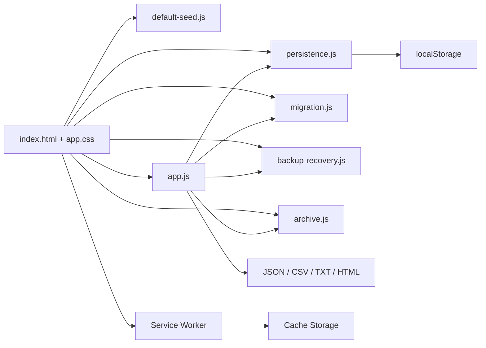
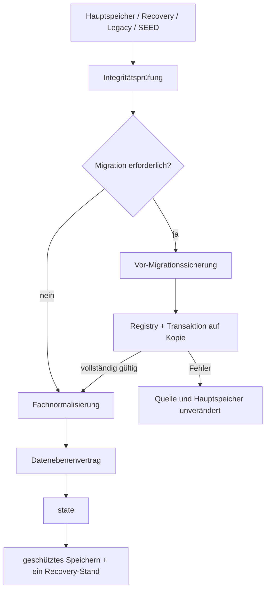
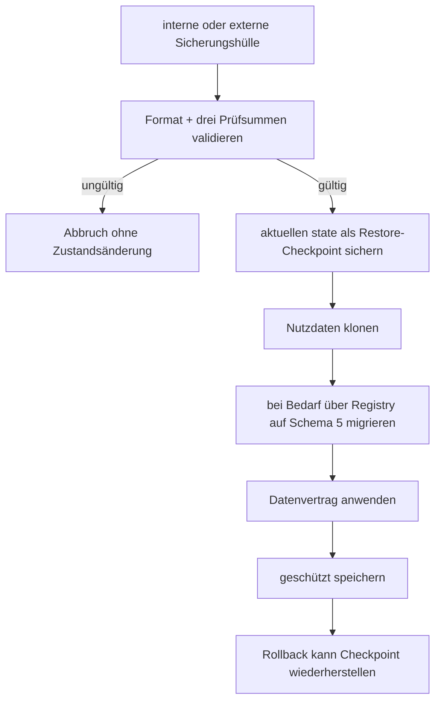

# NK-Pro – Architektur

**Ist-Stand:** V99.4.4  
**Datenschema:** 5  
**Datenebenenvertrag:** 1  
**Prinzip:** statische, lokale, frameworkfreie Browseranwendung

## 1. Laufzeit und Komponenten

NK-Pro läuft vollständig im Browser. Ein Webserver ist nur für PWA- und Service-Worker-Funktionen erforderlich.



### Produktive Verantwortlichkeiten

- `js/persistence.js`: einziger direkter Browser-Speicheradapter, Integritätsmetadaten und FNV-1a-Prüfsumme.
- `js/migration.js`: Schemaermittlung, eingefrorene Registry, Pfadplanung, Vor-/Nachvalidierung und transaktionale Migration.
- `js/backup-recovery.js`: Sicherungshüllen, eindeutige IDs, Prüfsummen, Serialisierung, Persistenzadapter und Restore-Validierung.
- `js/archive.js`: Snapshot-Projektion, Archivnormalisierung und Durchsetzung des Datenebenenvertrags.
- `js/default-seed.js`: Ausgangsdaten.
- `js/app.js`: Laufzeitzustand, Fachnormalisierung, Berechnung, UI-, Import-/Export-, Sicherungs- und Restore-Orchestrierung.
- `service-worker.js`: Network-first-App-Shell unter `nk-pro-v99-4-4`.

## 2. Verbindliche Ladefolge

```text
navigation.js
modal-events.js
persistence.js
migration.js
backup-recovery.js
archive.js
default-seed.js
app.js
service-worker-register.js
```

Die vier Kernmodule exportieren eingefrorene Namespaces:

- `NKProPersistence`
- `NKProMigration`
- `NKProBackupRecovery`
- `NKProArchive`

`app.js` prüft diese Namespaces vor der Initialisierung des Zustands. Globale Funktionsnamen bleiben nur als Kompatibilitätsfassaden erhalten. Migration, Backup/Restore und Archiv kennen weder DOM noch `localStorage`; Abhängigkeiten werden injiziert.

## 3. Arbeitszustand, Persistenz und Recovery

`state` bleibt die einzige schreibbare Laufzeitinstanz. Der Startpfad liest zuerst unveränderte Rohdaten. Ist der Arbeitsstand älter als Schema 5, wird vor jeder Normalisierung eine getrennte Vor-Migrationssicherung erzeugt. Erst danach läuft die Migration auf einer Kopie.



Der Recovery-Stand bleibt vom Vor-Migrationsbackup und vom Restore-Checkpoint getrennt.

## 4. Migrationsarchitektur

Die Registry unterstützt aktuell:

- `schema-1-to-2`
- `schema-2-to-4`
- `schema-3-to-4`
- `schema-4-to-5`

Ein Transaktionslauf:

1. klont die Quelle,
2. ermittelt den vollständigen Pfad,
3. validiert den Eingang,
4. führt jeden Schritt auf der Kopie aus,
5. validiert nach jedem Schritt und abschließend,
6. übernimmt das Ergebnis nur vollständig,
7. gibt bei Fehlern eine unveränderte Quellkopie zurück.

Der normale Anwendungsstart migriert nur den aktuellen Arbeitsstand. Historische Archivsnapshots werden nicht still verändert. Für ausdrücklich angeforderte Archivmigrationen unterstützt das Modul eine atomare rekursive Ausführung; scheitert ein Archivschritt, wird auch der bereits aktuelle Arbeitsstand nicht teilweise übernommen.

## 5. Sicherungshüllen

Das Format `nk-pro-backup-envelope` Version 1 enthält:

- Sicherungs-ID und Sicherungstyp,
- Erstellungszeit,
- Quell-Appversion,
- Quell- und Zielschema,
- Datenebenenvertrag,
- Quell-Speicherschlüssel und Anlass,
- Migrationspfad,
- Nutzdaten-, Metadaten- und Gesamthüllenprüfsumme,
- unveränderte Nutzdatenkopie.

Metadaten und Nutzdaten werden im laufenden Prozess tief eingefroren. Persistierte Änderungen werden durch die drei Prüfsummen erkannt. Die FNV-1a-Prüfsumme dient der Integritätsprüfung, nicht dem kryptografischen Echtheitsnachweis.

## 6. Restore und Rollback



Interne Vor-Migrationssicherungen werden im bestehenden Sicherungsbereich angeboten. Extern heruntergeladene Sicherungshüllen werden über den vorhandenen JSON-Import erkannt, validiert und mit Checkpoint wiederhergestellt.

## 7. Datenebenen und Snapshot-Grenzen

Abrechnungssnapshots enthalten ausschließlich abrechnungsbezogene Fachfelder. Sie enthalten nie `jahresArchiv`, `stammdaten`, `waterMeterHistory` oder technische Speicher-, Backup-, Recovery-, Migrations-, Restore- und Viewer-Metadaten.

- **Arbeitsstand:** aktuelle schreibbare Gesamtdaten.
- **Jahresarchiv:** Archivhülle plus genau ein begrenzter Abrechnungssnapshot.
- **Gesamtbackup:** vollständiger Arbeitsstand mit Stammdaten, globaler Historie und begrenztem Archiv.
- **Recovery:** ein vorheriger gültiger Arbeitsstand.
- **Vor-Migrationssicherung:** unveränderte Quelle vor Migration.
- **Restore-Checkpoint:** Arbeitsstand unmittelbar vor Restore.

Datenschema 5, Datenebenenvertrag 1 und Snapshot-Rolle `billingSnapshot` bleiben unverändert.

## 8. Testarchitektur

Die Freigabe umfasst:

- 10 JavaScript-Syntaxprüfungen,
- 6 kanonische Referenzdatenfälle,
- statische Release- und Modulgrenzenprüfung,
- 28 Playwright-/Chromium-Tests für Start, Navigation, Fachlogik, Persistenz, Archive, Registry, Fehlerabbruch, Sicherungshüllen, externen Restore, Rollback-Checkpoint und PWA.

## 9. Nächste Architekturgrenze

Das nächste empfohlene Datenmodellthema ist die Trennung dauerhafter Zählerstammdaten von periodischen Messwerten über eine stabile Zähler-ID. Dafür ist das V99.4.4-Migrations- und Sicherungsfundament verbindlich zu verwenden.
