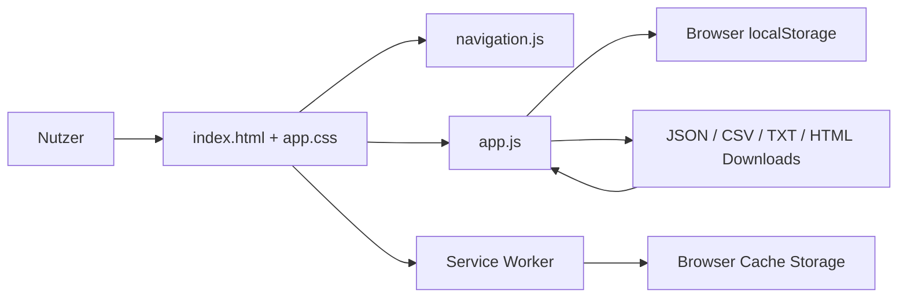
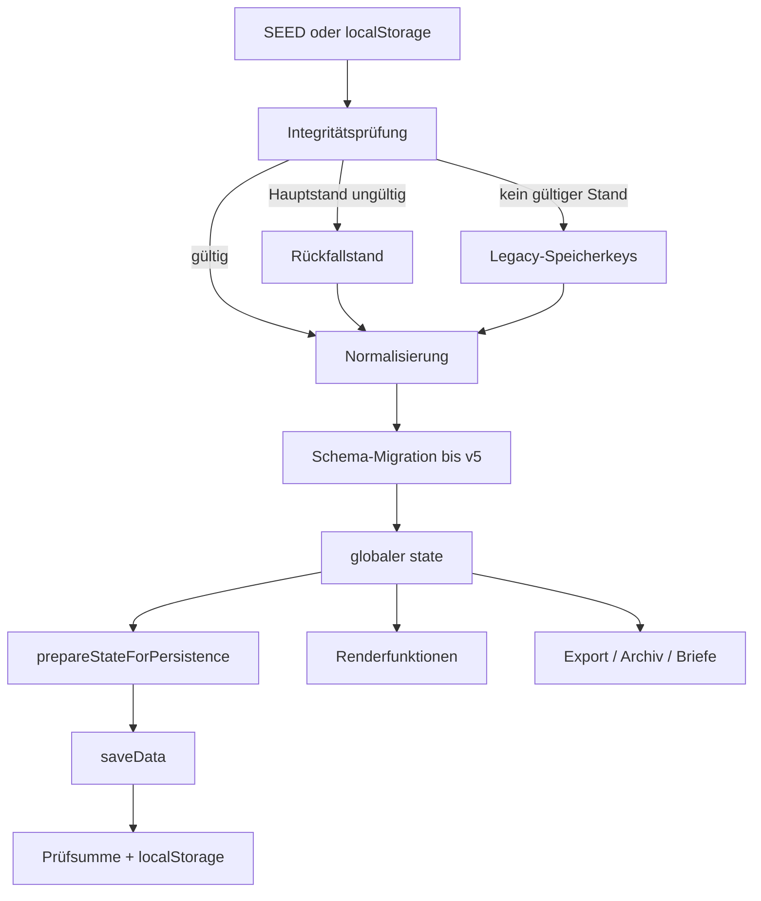

# NK-Pro – Architecture

**Ist-Stand:** V99.4.0  
**Datenschema:** 5  
**Architekturprinzip:** statische, lokale, frameworkfreie Browseranwendung

## 1. Systemkontext

NK-Pro läuft vollständig im Browser. Die Anwendung benötigt für den produktiven Betrieb weder Server noch Datenbank. Ein Webserver oder GitHub Pages ist nur für PWA- und Service-Worker-Funktionen erforderlich.



## 2. Laufzeitkomponenten

### `index.html`

- enthält die vollständige semantische Grundstruktur,
- enthält Landingpage, Sidebar und 16 funktionale Tabs,
- enthält Dialogcontainer und statische Abschnittshüllen,
- bindet CSS und JavaScript ausschließlich extern ein,
- verwendet weiterhin zahlreiche Inline-Ereignisattribute als Bindung an globale Funktionen.

### `assets/app.css`

- enthält Basisdesign, Navigation, Tabellen, Formulare und Dialoge,
- enthält Responsive-Regeln,
- enthält vollständige Brief- und Druckdarstellung,
- enthält historisch gewachsene, versionsbezogene Regelblöcke.

### `js/navigation.js`

- verwaltet die vier Accordion-Gruppen Objekt, Abrechnung, Archiv und Extras,
- speichert genau einen offenen Navigationszweig,
- verwaltet Sidebar-Zustand,
- aktiviert Abrechnungsdetails nur bei vorhandenem Abrechnungsstand,
- zeigt den Abrechnungskontext nur bei geöffneter Abrechnung,
- leitet Objekt, Jahr und Status aus vorhandenen App-Funktionen ab,
- ruft globale App-Funktionen auf.

### `js/modal-events.js`

- schließt den Kostenartendialog bei Klick auf den Hintergrund,
- schließt ihn mit Escape.

### `js/app.js`

Enthält derzeit fast alle Kernverantwortlichkeiten:

- eingebettete Ausgangsdaten,
- Version und Schemaversion,
- Speicherung und Prüfsumme,
- Importprüfung,
- Migration und Normalisierung,
- Stammdaten und Abrechnungssynchronisation,
- Archivierung und Archivansicht,
- Kostenarten und Vorauszahlungen,
- Zähler und Verbräuche,
- Umlage und Ergebnisse,
- Qualitätsprüfung,
- Briefe und Druck,
- Export,
- Release Audit,
- App Self Test,
- Rendering sämtlicher Tabs.

### `js/service-worker-register.js`

- registriert den Service Worker außerhalb des `file:`-Protokolls,
- zeigt einen Updatehinweis bei installierter neuer Version.

### `service-worker.js`

- cached die App-Shell unter `nk-pro-v99-4-0`,
- löscht beim Aktivieren alle anderen Cache-Namen,
- verwendet Network-first,
- fällt offline auf Cache beziehungsweise `index.html` zurück.

## 3. Zustands- und Datenfluss



### Zentraler Zustand

`state` ist die einzige zentrale Laufzeitinstanz. Archivansichten ersetzen diesen Zustand temporär und halten den vorherigen Arbeitszustand in `archiveReturnState`.

### Änderungspfad

`commitStateChange()` ist der bevorzugte zentrale Pfad für fachliche Änderungen. Er bereitet den Zustand vor, speichert ihn und stößt ein vollständiges oder gezieltes Rendering an.

### Schreibschutz

Speichern wird blockiert, wenn:

- eine Archivansicht geöffnet ist,
- die aktuelle Abrechnung finalisiert ist,
- kein ausdrücklich kontrollierter Finalisierungs-Bypass aktiv ist.

## 4. Persistenz

### Speicherbereiche

| Schlüssel | Funktion |
|---|---|
| `nkpro_browser_v85_qualitaets_cockpit_data` | aktueller Hauptdatenstand |
| gleicher Schlüssel + `_last_valid` | vorheriger gültiger Rückfallstand |
| zahlreiche Legacy-Schlüssel | Übernahme älterer Versionen |
| `nkpro.workflowNavigation.v2` | offener Navigationszweig |
| `nkpro.sidebarCollapsed.v1` | Sidebar-Zustand |

### Integrität

Vor dem Speichern werden Integritätsmetadaten entfernt, der Rest serialisiert und mit FNV-1a-32 gehasht. Beim Lesen wird die Prüfsumme validiert. Das Verfahren schützt vor typischer Datenbeschädigung, nicht vor Manipulation.

### Speichergrenzen

Die Anwendung warnt intern bei etwa 4 MB und bewertet etwa 4,7 MB als kritisch. Da Jahresarchive vollständige Snapshots enthalten, wächst der Datenstand mit jeder archivierten Abrechnung.

## 5. Datenebenen

### Objekt-/Stammdaten

`stammdaten` enthält zentrale Wohnungen und Mietverhältnisse. Funktionen können diese Daten in die aktuelle Abrechnung übernehmen oder mit ihr abgleichen.

### Aktuelle Abrechnung

Die Root-Bereiche `wohnungen`, `mieter`, `kostenarten`, `vorauszahlungen`, Zähler-, Umlage- und Brieffelder bilden den bearbeiteten Abrechnungsstand.

### Archiv

`jahresArchiv` enthält Datensätze mit:

- Jahr und Periode,
- Archivdatum,
- Metadaten,
- Zusammenfassung,
- vollständigem Snapshot unter `data`.

### Historische Einzelwerte

Legacy-Importe werden in ein vereinheitlichtes Format unter `abrechnungsEinzelwerte` überführt.

## 6. Berechnungsarchitektur

Die Umlage wird aus folgenden Quellen gebildet:

- Wohnfläche,
- Personen oder Personentage,
- Wohneinheiten,
- Verbrauch/Zähler,
- direkte Eurobeträge,
- externe Einzelabrechnungen,
- manuelle Werte.

Kostenarten werden über stabile Kosten-IDs angesprochen. Die Berechnung trennt Mieterergebnisse, Eigentümer-/Privatanteile und offene beziehungsweise nicht zugeordnete Anteile. Kontrolltabellen und Briefe verwenden denselben berechneten Ergebnisstand.

## 7. Rendering

- Jeder Tab besitzt eigene Renderfunktionen.
- `renderAll()` schützt gegen parallele Renderläufe und sammelt Fehler.
- `renderCurrentView()` entscheidet zwischen Gesamt- und Teilrendering.
- `TAB_DEFINITIONS` liefert Titel und Übersichtsdaten.
- `auditV992Structure()` prüft den statischen Seitenrahmen.

Die Architektur ist DOM-basiert und setzt viel HTML als Strings zusammen. Das reduziert Abhängigkeiten, erhöht aber Kopplung und Testbedarf.

## 8. Import und Export

### Import

- Gesamt-JSON kann geprüft und normalisiert werden.
- Archiv-JSON und historische Einzelabrechnungen können importiert werden.
- Legacy-Dokumente werden textuell erkannt und in Archivwerte überführt.

### Export

- Gesamt-JSON,
- JSON nur der aktuellen Abrechnung,
- Kostenarten-CSV,
- Mieter-CSV,
- Umlage-CSV,
- Archivindex-CSV,
- Prüfbericht-TXT,
- App-HTML-Kopie,
- mehrere Exportpakete.

Formatänderungen sind rückwärtskompatibilitätsrelevant und lösen die Stop-Regel aus.

## 9. Testarchitektur

Die Produktivdateien besitzen keine Testabhängigkeit. Für Entwicklung werden verwendet:

- Node.js,
- `node --check`,
- lokaler statischer Testserver,
- Playwright 1.61.1,
- Chromium,
- isolierte Browserkontexte und gemockter `localStorage`,
- sechs JSON-Referenzfälle.

Details stehen in `TESTING.md`.

## 10. Zielarchitektur ohne Neuentwicklung

Die bestehende Architektur bleibt Grundlage. Geplante Entwicklung erfolgt in dieser Reihenfolge:

1. vorhandene Tabs und Modussteuerung für das neue UX-Ziel wiederverwenden – umgesetzt in V99.4.0,
2. Navigation und Landingpage ohne Datenmodelländerung umbauen – umgesetzt in V99.4.0,
3. Objektstandard und Abrechnungssnapshot formal absichern,
4. Zählerverwaltung als eigene Domäne entwerfen,
5. Migrationen mit Vorabbackup und Rollback standardisieren,
6. `js/app.js` erst danach schrittweise nach vorhandenen Verantwortlichkeiten aufteilen.

### Mögliche spätere Dateigrenzen

Nur nach separater Freigabe und ohne Buildsystem:

```text
js/
  app.js                  # Start und Orchestrierung
  data-storage.js         # Speicherung, Integrität, Backup
  data-migrations.js      # Migrationen
  domain-billing.js       # Abrechnung und Berechnung
  domain-meters.js        # Zählerverwaltung und Stände
  domain-archive.js       # Archiv
  ui-render.js            # gemeinsame Renderhilfen
  ui-letters.js           # Briefe und Druck
```

Dies ist kein beschlossener Umbau, sondern eine risikoarme mögliche Modularisierungsrichtung. Vor jeder Aufteilung ist die tatsächliche Kopplung erneut zu analysieren.

## 11. UI-Orchestrierung V99.4.0

Die Landingpage ist kein Fachzustand und verändert `state` nicht. Sie wird über `switchToTab("landing")` geöffnet.

Der Abrechnungskontext verwendet `billingContextOpen` ausschließlich als flüchtigen UI-Zustand. Persistierte Werte werden dafür weder ergänzt noch verändert. Die Statusableitung lautet:

- Archivansicht → Nur Ansicht,
- gültig finalisierte aktuelle Abrechnung → Finalisiert,
- sonstige geöffnete aktuelle Abrechnung → Bearbeitung.

`objekt` und `archiv` sind neue UI-Hubs. Sie verwenden vorhandene Daten und Funktionen; sie führen keine neue Objektstandard- oder Archivdomäne ein. Die genaue Alt-zu-Neu-Zuordnung steht in `UI_ARCHITEKTUR_V99_4_0.md`.
