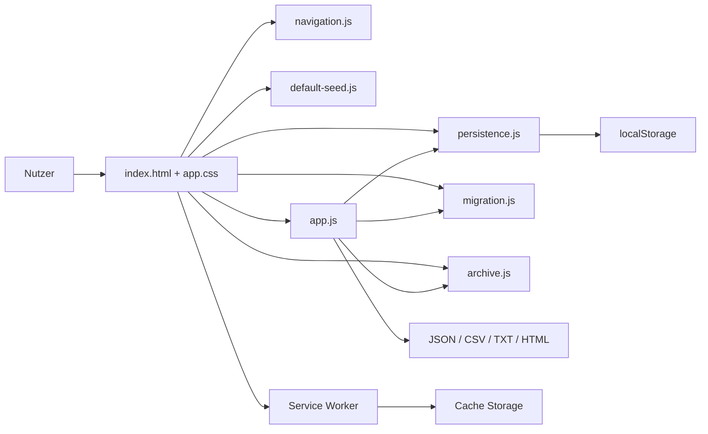
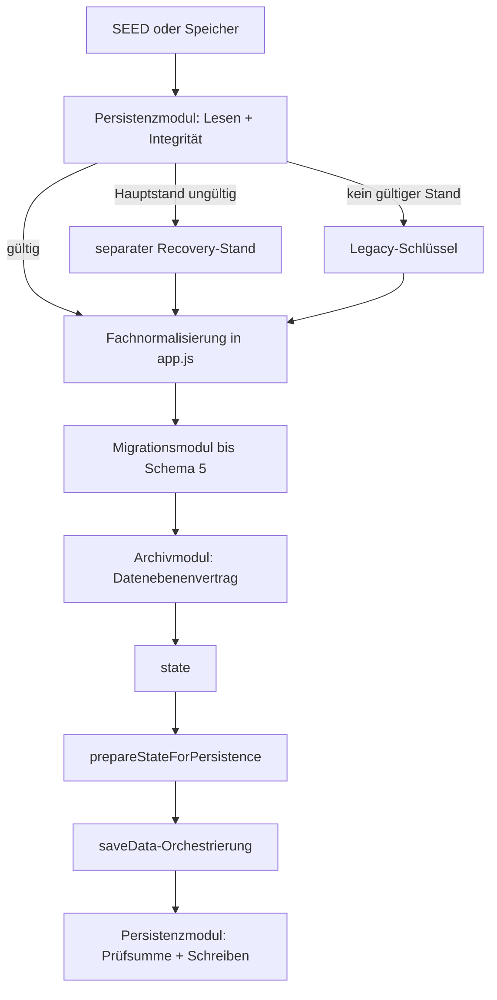
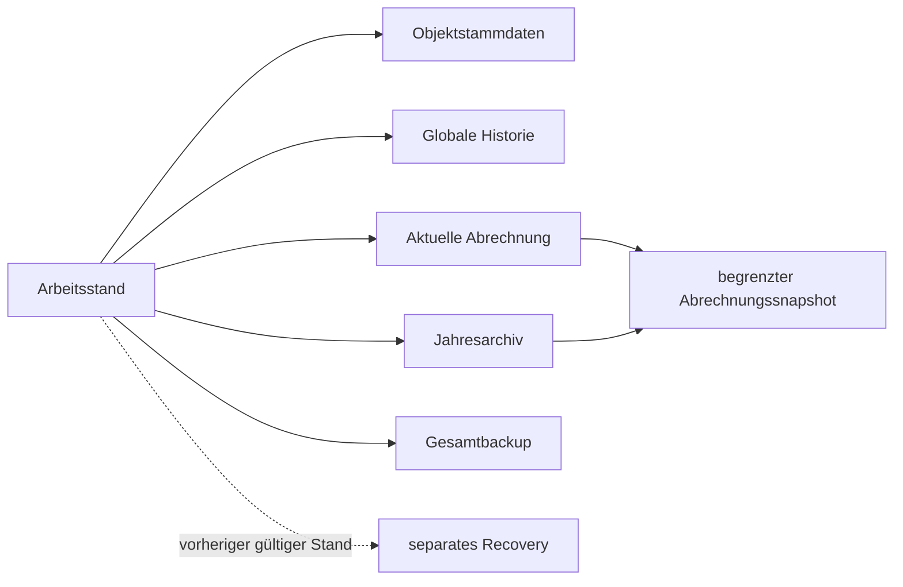

# NK-Pro – Architektur

**Ist-Stand:** V99.4.3  
**Datenschema:** 5  
**Datenebenenvertrag:** 1  
**Prinzip:** statische, lokale, frameworkfreie Browseranwendung

## 1. Laufzeit

NK-Pro läuft vollständig im Browser. Ein Server ist nur für PWA- und Service-Worker-Funktionen erforderlich; die Fachanwendung bleibt direkt über `index.html` nutzbar.



## 2. Produktive Komponenten

- `index.html`: semantische Grundstruktur, Landingpage, Sidebar, Tabs, Dialogcontainer und verbindliche Skriptreihenfolge.
- `assets/app.css`: Bildschirm-, Responsive- und Druckdarstellung.
- `js/persistence.js`: Browser-Speicheradapter, FNV-1a-Prüfsumme, Integritätsmetadaten und Speicherdiagnostik.
- `js/migration.js`: Datenschemaermittlung, idempotente Migrationshistorie, Migration bis Schema 5 und Übernahme vorbelegter Altarchive.
- `js/archive.js`: Snapshot-Metafilter, begrenzte Projektion, Archivhüllen-Normalisierung und Durchsetzung des Datenebenenvertrags.
- `js/default-seed.js`: Ausgangsdaten; bewusst vom Fachcode getrennt.
- `js/app.js`: Zustand, fachliche Normalisierung, Berechnung, UI-Orchestrierung, Briefe und Export sowie kleine globale Kompatibilitätsfassaden.
- `js/navigation.js`: Navigation, Sidebar und Abrechnungskontext.
- `js/modal-events.js`: globale Modalereignisse.
- `js/service-worker-register.js`: Registrierung und Updatehinweis.
- `service-worker.js`: Network-first-App-Shell unter `nk-pro-v99-4-3`.

## 3. Lade- und Abhängigkeitsgrenzen

Die produktive Reihenfolge lautet:

```text
navigation.js
modal-events.js
persistence.js
migration.js
archive.js
default-seed.js
app.js
service-worker-register.js
```

Die drei Kernmodule sind klassische, buildfreie Browserdateien. Sie exportieren jeweils genau einen eingefrorenen Namespace auf `globalThis`:

- `NKProPersistence`,
- `NKProMigration`,
- `NKProArchive`.

`app.js` prüft diese Namespaces vor der Initialisierung von `state`. Bestehende globale Funktionen bleiben erhalten und delegieren an die Module. Dadurch bleiben HTML-Ereignisattribute, bestehende Tests und interner Anwendungscode kompatibel.

Nur das Persistenzmodul kennt `localStorage`. Migration und Archiv besitzen keine DOM- oder Speicherabhängigkeit. Fachabhängigkeiten werden als Funktionen und Konstanten übergeben.

## 4. Zentraler Arbeitszustand und Persistenz

`state` bleibt die einzige schreibbare Laufzeitinstanz. Der Startzustand entsteht aus gültigem Hauptspeicher, Recovery-/Legacy-Daten oder dem SEED. Danach folgen fachliche Normalisierung, Migration bis Schema 5 und Durchsetzung des Datenebenenvertrags.



Die UI-gebundene Speicherorchestrierung bleibt in `app.js`: Schreibschutz von Archivansichten und finalisierten Abrechnungen, UI-Meldungen, Erzeugung des Recovery-Stands und Aktualisierung des Laufzeitzustands. Die technischen Speicheroperationen liegen im Persistenzmodul.

## 5. Datenebenen und Snapshot-Projektion



Der begrenzte Snapshot enthält nur abrechnungsbezogene Felder. Er enthält niemals `jahresArchiv`, `stammdaten`, `waterMeterHistory` oder technische Speicher-, Backup-, Recovery- und Viewer-Metadaten. Diese Grenze wird im Archivmodul identisch wie in V99.4.2 durchgesetzt.

## 6. Migration

Das Migrationsmodul kennt ausschließlich die Schemaversionsschritte bis Schema 5 und die Identität vorbelegter Altarchive. Fachhelfer für Wohnungs- und Mieter-IDs, Stammdaten und numerische Werte werden explizit übergeben. Rekursive Archivmigrationen können über `includeArchives:false` begrenzt werden.

Die Modularisierung selbst verändert weder Schema noch Nutzdaten. Ein Rückweg zu V99.4.2 erfordert deshalb keine Datenrückmigration.

## 7. Archivansicht und Wiederbearbeitung

Archivansichten verwenden einen begrenzten Snapshot als schreibgeschützten Laufzeitzustand. Erforderliche Objektstammdaten werden zur Laufzeit abgeleitet; die globale Zählerhistorie wird aus dem aktuellen Arbeitsstand bereitgestellt.

Bei der Wiederbearbeitung wird der Abrechnungssnapshot übernommen. Aktuelle `stammdaten`, aktuelle `waterMeterHistory`, operative Backup-Metadaten und das vollständige `jahresArchiv` bleiben erhalten.

## 8. Austauschformate

- **Gesamtbackup:** Arbeitsstand, Stammdaten, globale Historie und begrenztes Jahresarchiv; kein Recovery.
- **Abrechnungs-JSON:** ein begrenzter Abrechnungssnapshot; kein Archiv, keine Stammdaten, keine globale Historie.
- **Archivexport:** begrenzte Archivhüllen und Snapshots.

Datenschema 5, Datenebenenvertrag 1 und alle Rollenkennzeichnungen bleiben unverändert.

## 9. Testarchitektur

Die sechs logischen Referenzfälle werden aus einer vollständigen Basis und fünf kleinen Patches erzeugt. Playwright prüft zusätzlich:

- Start, Navigation und Fachreferenzen,
- Modulreihenfolge und eingefrorene Namespaces,
- globale Kompatibilitätsfunktionen,
- Persistenz, Recovery und Integrität,
- Snapshot-Grenzen, Archivmigration und Wiederbearbeitung,
- Austauschformate und Service-Worker-App-Shell.

Die Releaseprüfung verbietet direkte `localStorage`-Zugriffe außerhalb von `js/persistence.js` und sichert die exakte Skriptreihenfolge statisch ab.

## 10. Nächste Architekturgrenze

Vor einer neuen Schemaversion werden ein externes unveränderliches Vor-Migrationsbackup, eine formalisierte Migrationsregistry, Vor-/Nachvalidierung und ein getesteter allgemeiner Rollback benötigt. Eine weitere Zerlegung von `app.js` erfolgt danach schrittweise und ohne gleichzeitige Fach- oder UI-Neuentwicklung.
