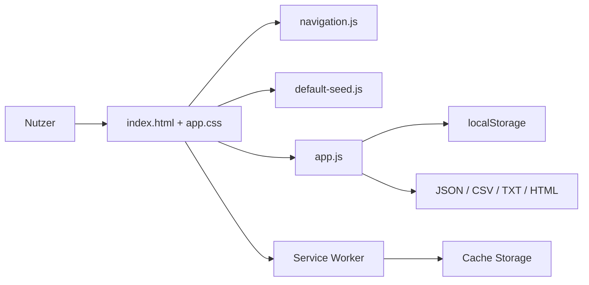
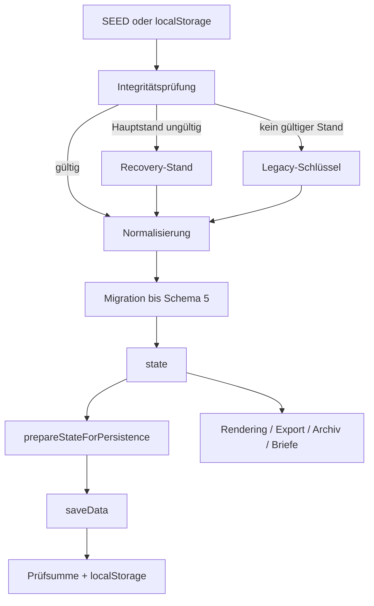

# NK-Pro – Architektur

**Ist-Stand:** V99.4.1  
**Datenschema:** 5  
**Prinzip:** statische, lokale, frameworkfreie Browseranwendung

## 1. Laufzeit

NK-Pro läuft vollständig im Browser. Ein Server ist nur für PWA- und Service-Worker-Funktionen erforderlich; die Fachanwendung bleibt direkt über `index.html` nutzbar.



## 2. Produktive Komponenten

- `index.html`: semantische Grundstruktur, Landingpage, Sidebar, Tabs und Dialogcontainer.
- `assets/app.css`: Bildschirm-, Responsive- und Druckdarstellung.
- `js/default-seed.js`: unveränderte Ausgangsdaten; bewusst vom Fachcode getrennt.
- `js/app.js`: Zustand, Persistenz, Migration, Archiv, Berechnung, Briefe, Export und Rendering.
- `js/navigation.js`: Navigation, Sidebar und Abrechnungskontext.
- `js/modal-events.js`: globale Modalereignisse.
- `js/service-worker-register.js`: Registrierung und Updatehinweis.
- `service-worker.js`: Network-first-App-Shell unter `nk-pro-v99-4-1`.

Die Trennung des SEED reduziert den Analysekontext, ist aber noch keine fachliche Modularisierung.

## 3. Zentraler Zustand

`state` bleibt die einzige zentrale Laufzeitinstanz. Der Startzustand entsteht aus gültigem `localStorage`, Recovery-/Legacy-Daten oder dem SEED. Danach folgen Integritätsprüfung, Normalisierung und Migration bis Schema 5.



Archivansichten ersetzen `state` temporär und halten den vorherigen Arbeitszustand in `archiveReturnState`. Diese Kopplung ist Bestandteil des nächsten Architekturarbeitspakets.

## 4. Testarchitektur

Die sechs logischen Referenzfälle werden aus einer vollständigen Basis und fünf kleinen Patches erzeugt:

```text
testdaten/
  basis/standardfall.json
  faelle/*.patch.json
  fixture-manifest.json
```

`tests/fixture-loader.cjs` rekonstruiert die Fälle. `tools/check-fixtures.cjs` vergleicht kanonische SHA-256-Werte und verhindert unbeabsichtigte fachliche Änderungen.

## 5. Offene Architekturgrenzen

Noch nicht formal getrennt sind:

- Objektstandard und aktuelle Abrechnung,
- fachliche Historie und unveränderlicher Abrechnungssnapshot,
- Archivdaten und aktuelle Arbeitsdaten,
- externe Sicherung und interner Recovery-Stand,
- zentrale Stammdaten und jahresbezogene Kopien.

Diese Grenzen müssen vor größerer UI- oder Modularisierungsarbeit verbindlich definiert werden.

## 6. Zielrichtung

1. Datenebenen und Snapshot-Grenzen festlegen.
2. Migration, Vorabbackup und Rückweg absichern.
3. Archivkopien und LocalStorage-Wachstum begrenzen.
4. Erst danach `js/app.js` schrittweise nach stabilen Verantwortlichkeiten aufteilen.

Mögliche spätere Grenzen sind Persistenz, Migration, Abrechnung, Zähler, Archiv, Rendering und Briefe. Eine Komplettneuschreibung ist nicht vorgesehen.
