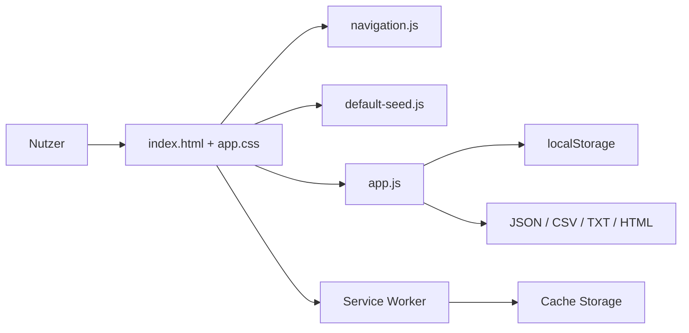
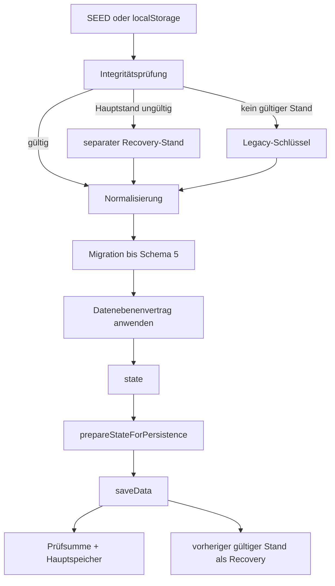
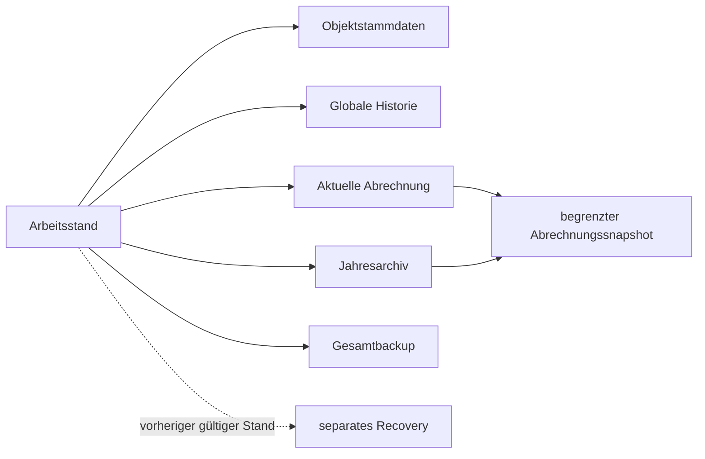

# NK-Pro – Architektur

**Ist-Stand:** V99.4.2  
**Datenschema:** 5  
**Datenebenenvertrag:** 1  
**Prinzip:** statische, lokale, frameworkfreie Browseranwendung

## 1. Laufzeit

NK-Pro läuft vollständig im Browser. Ein Server ist nur für PWA- und Service-Worker-Funktionen erforderlich; die Fachanwendung bleibt direkt über `index.html` nutzbar.



## 2. Produktive Komponenten

- `index.html`: semantische Grundstruktur, Landingpage, Sidebar, Tabs und Dialogcontainer.
- `assets/app.css`: Bildschirm-, Responsive- und Druckdarstellung.
- `js/default-seed.js`: Ausgangsdaten; bewusst vom Fachcode getrennt.
- `js/app.js`: Zustand, Persistenz, Datenvertrag, Migration, Archiv, Berechnung, Briefe, Export und Rendering.
- `js/navigation.js`: Navigation, Sidebar und Abrechnungskontext.
- `js/modal-events.js`: globale Modalereignisse.
- `js/service-worker-register.js`: Registrierung und Updatehinweis.
- `service-worker.js`: Network-first-App-Shell unter `nk-pro-v99-4-2`.

Die Trennung des SEED reduziert den Analysekontext, ist aber noch keine fachliche Modularisierung.

## 3. Zentraler Arbeitszustand und Persistenz

`state` bleibt die einzige schreibbare Laufzeitinstanz. Der Startzustand entsteht aus gültigem `localStorage`, Recovery-/Legacy-Daten oder dem SEED. Danach folgen Integritätsprüfung, Normalisierung, Migration bis Schema 5 und Durchsetzung des Datenebenenvertrags.



Der Recovery-Stand ist nicht Teil von `state`, des Jahresarchivs oder des Gesamtbackups. Er liegt unter einem eigenen Speicherschlüssel und enthält keine Recovery-Kette.

## 4. Datenebenen und Snapshot-Projektion



Der begrenzte Snapshot enthält nur abrechnungsbezogene Felder. Er enthält niemals:

- `jahresArchiv`,
- `stammdaten`,
- `waterMeterHistory`,
- Speicherintegritäts-, Backup-, Recovery- oder Viewer-Metadaten.

Jeder Archivdatensatz besteht aus Archivhülle, Zusammenfassung und genau einem solchen Snapshot. Vorhandene Altarchive werden idempotent auf diese Grenze projiziert.

## 5. Archivansicht und Wiederbearbeitung

Archivansichten verwenden einen begrenzten Snapshot als schreibgeschützten Laufzeitzustand. Erforderliche Objektstammdaten werden zur Laufzeit aus den archivierten Abrechnungsdaten abgeleitet; die globale Zählerhistorie wird zur Laufzeit aus dem aktuellen Arbeitsstand bereitgestellt.

Bei der Wiederbearbeitung wird der Abrechnungssnapshot übernommen. Aktuelle `stammdaten`, aktuelle `waterMeterHistory`, operative Backup-Metadaten und das vollständige `jahresArchiv` bleiben erhalten.

## 6. Austauschformate

- **Gesamtbackup:** Arbeitsstand, Stammdaten, globale Historie und begrenztes Jahresarchiv; kein Recovery.
- **Abrechnungs-JSON:** ein begrenzter Abrechnungssnapshot; kein Archiv, keine Stammdaten, keine globale Historie.
- **Archivexport:** begrenzte Archivhüllen und Snapshots.

Das Datenschema bleibt 5; Vertragsrollen und Snapshot-Grenzen werden additiv in Metadaten gekennzeichnet.

## 7. Testarchitektur

Die sechs logischen Referenzfälle werden aus einer vollständigen Basis und fünf kleinen Patches erzeugt:

```text
testdaten/
  basis/standardfall.json
  faelle/*.patch.json
  fixture-manifest.json
```

`tests/fixture-loader.cjs` rekonstruiert die Fälle. `tools/check-fixtures.cjs` vergleicht kanonische SHA-256-Werte und verhindert unbeabsichtigte fachliche Änderungen. Playwright prüft zusätzlich Datenebenen, Snapshot-Grenzen, Archivmigration, Recovery und Austauschformate im Browser.

## 8. Nächste Architekturgrenze

Persistenz/Integrität, Normalisierung/Migration und Archiv/Snapshot-Projektion sollen schrittweise aus `js/app.js` ausgelagert werden. Der Datenebenenvertrag aus V99.4.2 ist dabei die verbindliche Schnittstelle. Eine Komplettneuschreibung ist nicht vorgesehen.
